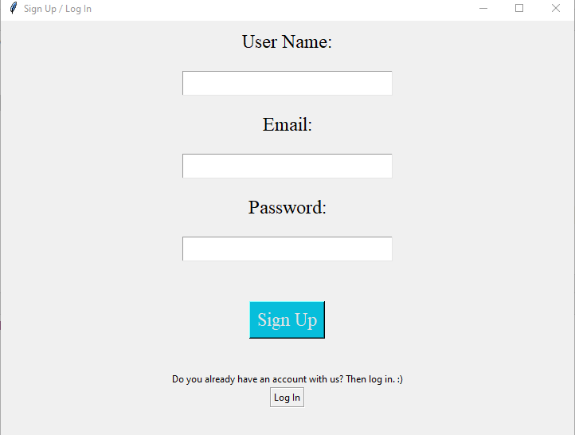
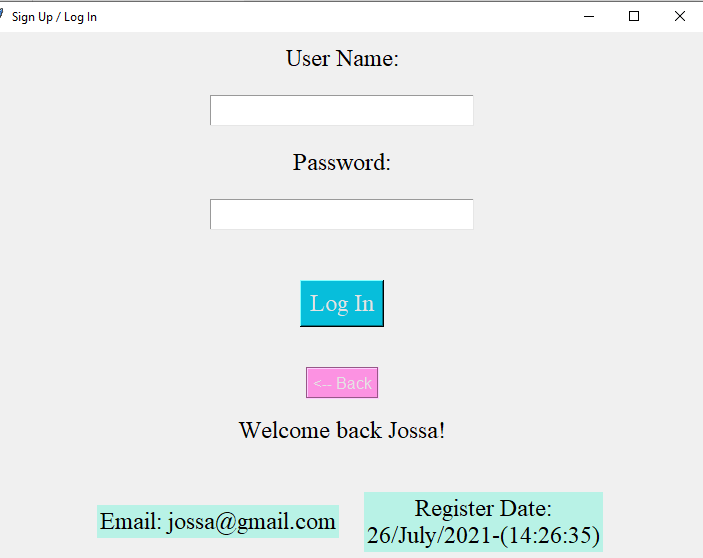

# Login-Program 
Learning more about Algorithms and DS with Python

For this project I used algorithms like: 
* Merge Sort
* Binary Search

I use file to keep track of the users. I sorted them by the first letter in their names
I've been feeling a little confused about how merge sort works and that the reason of this projects, learn from a practical way.

# How it works?
When you add a user it will create a .txt file, then will write the information and finally sort the users implementing merge sort.
In the part of login what I did is implement binary search using the build-in function ord() to take the first letter of the name of the user to be able of make a effective search.

Preview of the program:

Sign Up Part                          |  Log In Part
:---------------------------------------:|:---------------------------------------:
  |  

